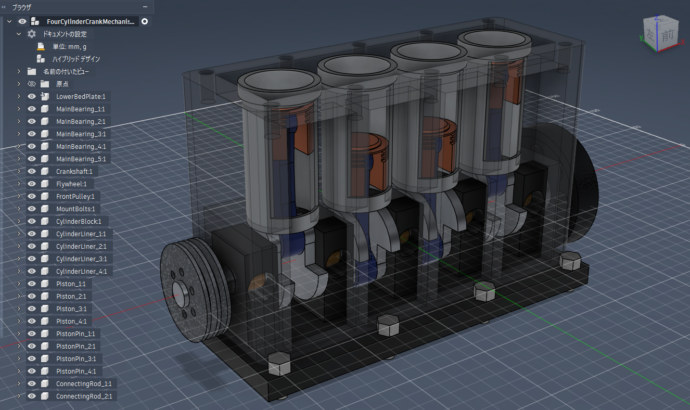
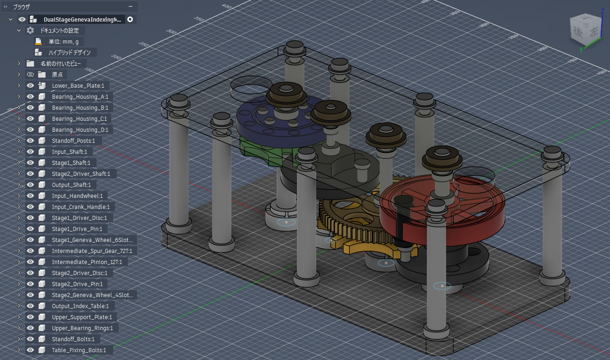
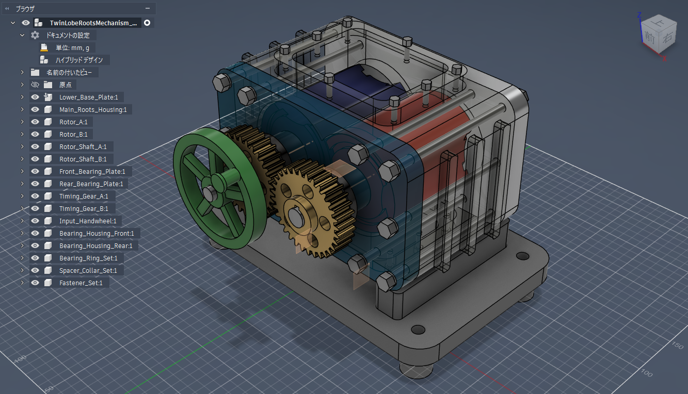
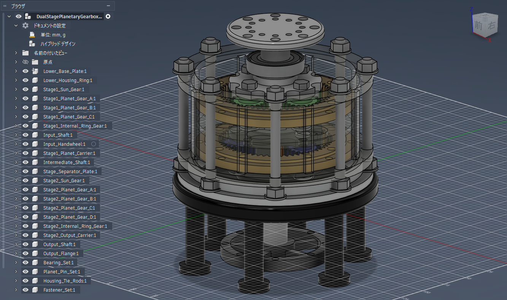

# AI生成による2.5D機構モデル
## AI-Generated 2.5D Mechanisms

Autodesk Fusionを操作するAIエージェントが生成した、4種類の機構モデルです。

一見すると複雑に見える3Dモデルが、実際にはどのようなモデリング操作で構築されているのかを確認するために作成しました。

各モデルの形状生成は、主に以下の操作で構成されています。

- 2Dスケッチ
- 押し出しによる形状の追加・除去
- 新規コンポーネントの作成
- 基準平面およびオフセット平面
- 円形パターン
- 一部のフィレットおよび面取り

## 収録モデル

### 1. Four-Cylinder Crank Mechanism

4つのシリンダー、ピストン、コネクティングロッド、クランクシャフトなどで構成された機構モデルです。

完成形は複雑に見えますが、円筒形状や板状形状をスケッチと押し出しで作成し、それらを組み合わせることで構築されています。

- Fusion Viewer：[ブラウザで3Dモデルを見る](https://a360.co/4qhLR25)
- F3D：[Fusionデータをダウンロード](https://raw.githubusercontent.com/liclog-net/cad-models/main/collections/ai-generated-2-5d-mechanisms/models/four-cylinder-crank/FourCylinderCrankMechanism_2_5D_AI_Model.f3d)
- STEP：[STEPデータをダウンロード](https://raw.githubusercontent.com/liclog-net/cad-models/main/collections/ai-generated-2-5d-mechanisms/models/four-cylinder-crank/FourCylinderCrankMechanism_2_5D_AI_Model.step)

---

### 2. Dual-Stage Geneva Indexing Mechanism

2組のゼネバ機構、中間歯車、複数の回転軸、出力テーブルを組み合わせた二段式の間欠割出し機構です。

多数の部品から構成されていますが、形状生成の中心はスケッチと押し出しです。

- Fusion Viewer：[ブラウザで3Dモデルを見る](https://a360.co/3U3FDXo)
- F3D：[Fusionデータをダウンロード](https://raw.githubusercontent.com/liclog-net/cad-models/main/collections/ai-generated-2-5d-mechanisms/models/dual-stage-geneva/DualStageGenevaIndexingMechanism_2_5D_AI_Model.f3d)
- STEP：[STEPデータをダウンロード](https://raw.githubusercontent.com/liclog-net/cad-models/main/collections/ai-generated-2-5d-mechanisms/models/dual-stage-geneva/DualStageGenevaIndexingMechanism_2_5D_AI_Model.step)

---

### 3. Twin-Lobe Roots Mechanism

2つのローブローター、同期歯車、シャフト、軸受、ハウジングで構成されたルーツ式回転機構です。

複数の基準平面に2D輪郭を作成し、それぞれを押し出すことで、立体的な装置全体を構築しています。

- Fusion Viewer：[ブラウザで3Dモデルを見る](https://a360.co/4zhBbEJ)
- F3D：[Fusionデータをダウンロード](https://raw.githubusercontent.com/liclog-net/cad-models/main/collections/ai-generated-2-5d-mechanisms/models/twin-lobe-roots/TwinLobeRootsMechanism_2_5D_AI_Model.f3d)
- STEP：[STEPデータをダウンロード](https://raw.githubusercontent.com/liclog-net/cad-models/main/collections/ai-generated-2-5d-mechanisms/models/twin-lobe-roots/TwinLobeRootsMechanism_2_5D_AI_Model.step)

---

### 4. Dual-Stage Planetary Gearbox

太陽歯車、遊星歯車、内歯リングギア、キャリアを上下二段に積層した遊星歯車機構です。

同心円状に配置された多数の部品によって精密な装置に見えますが、各歯車や支持部品は主に2D輪郭の押し出しで作成されています。

- Fusion Viewer：[ブラウザで3Dモデルを見る](https://a360.co/4gymYvv)
- F3D：[Fusionデータをダウンロード](https://raw.githubusercontent.com/liclog-net/cad-models/main/collections/ai-generated-2-5d-mechanisms/models/dual-stage-planetary/DualStagePlanetaryGearbox_2_5D_AI_Model.f3d)
- STEP：[STEPデータをダウンロード](https://raw.githubusercontent.com/liclog-net/cad-models/main/collections/ai-generated-2-5d-mechanisms/models/dual-stage-planetary/DualStagePlanetaryGearbox_2_5D_AI_Model.step)

## データ形式

### Fusion Viewer

Fusionや専用ビューアをインストールせず、ブラウザ上でモデルを回転・拡大し、部品構成や断面を確認できます。

共有リンクは閲覧用です。閲覧者が公開元のFusionデータを直接変更することはできません。

### F3D

Autodesk Fusionのネイティブデータです。コンポーネント、スケッチ、フィーチャータイムラインを確認できます。

### STEP

他のCADでも形状を確認しやすい中間ファイルです。Fusionのスケッチやフィーチャータイムラインは含まれません。

## 注意事項

- これらはAIによるCAD形状生成能力を確認するための概念モデルです。
- 機構の動作、干渉、強度、公差、バックラッシ、製造可能性は検証していません。
- 歯車形状は標準的なインボリュート歯形を厳密に再現していない場合があります。
- スケッチには未拘束または拘束不足のものが含まれます。
- 実際の製品設計や製造には使用しないでください。

## 関連記事

Zenn記事の公開後にリンクを追加します。

---

## English Summary

This collection contains four mechanical models generated by an AI agent operating Autodesk Fusion.

Although the completed assemblies appear mechanically complex, their geometry was created primarily through 2D sketches and extrusion features. Some construction planes, patterns, fillets, and chamfers are also included.

These models are provided as experimental and educational examples. Mechanical operation, interference, strength, tolerances, gear accuracy, and manufacturability have not been fully validated.

The native F3D files preserve the Fusion component structure, sketches, and feature timeline. STEP files are provided for geometry inspection in other CAD systems.
